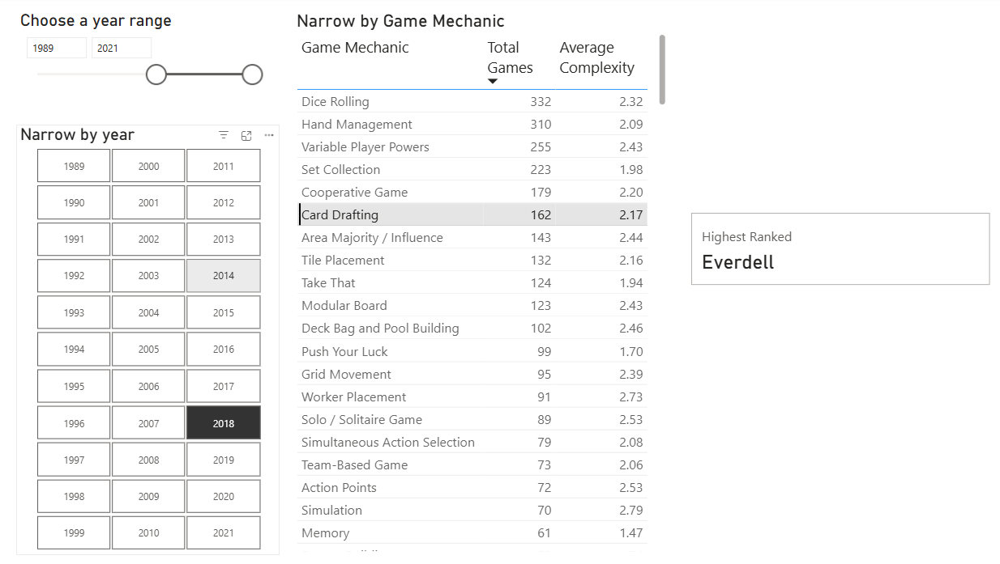
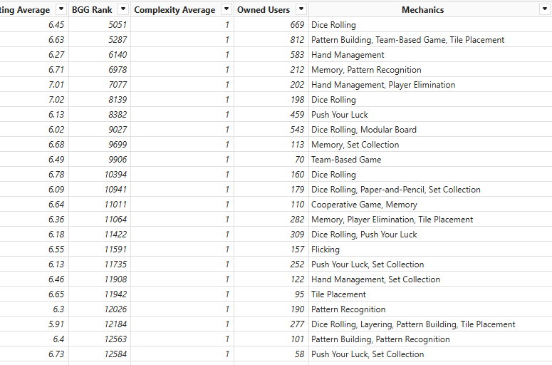
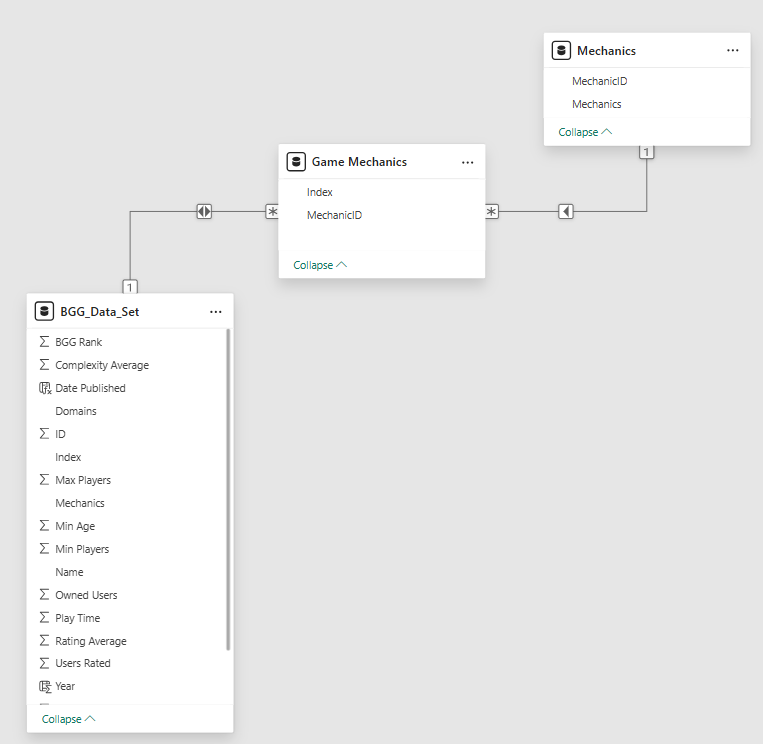

# Highest Ranked Game by Game Mechanics

## Summary
This is an extension of the report created in the exploratory data analysis of board games. 

The Power BI dashboard can be used to find the most popular board game in a time range or a specific year based on the game mechanics present in the game. 

The report also shows how many games use a given mechanic and what is the average complexity of games having a given game mechanic.

## Dashboard
The [Power BI report template](./BoardGameMechanics.pbit) contains the final visual. 


> To view the report in Power BI Desktop, download the [data source csv file][data_source] to a local path and enter the path in the parameter when prompted.

## Project Notes
### Data Source
Data sourced from kaggle dataset [melissamonfared/board-games][data_source] which was extracted from [Board Game Geek][bgg_website]  
Data source was last updated in 2022

### Schema Transformations
In the original dataset the mechanics were present as comma-separated values in a single column. 


In order to create the visual, the original fact table was split into multiple rows, and normalized into dimension tables in a snowflake schema using power query transformations.



Finally, a table visual was added and using DAX expressions, the selections in the slicers and tables were used to extract the board game with the highest rank.

#### Custom Measure : Highest Ranked Game

```dax
Highest Ranked = 
VAR BestRank = MIN('BGG_Data_Set'[BGG Rank])
RETURN CALCULATETABLE(VALUES(BGG_Data_Set[Name]), BGG_Data_Set[BGG Rank] = BestRank)
```


[bgg_website]: https://boardgamegeek.com
[data_source]: https://www.kaggle.com/datasets/melissamonfared/board-games/data